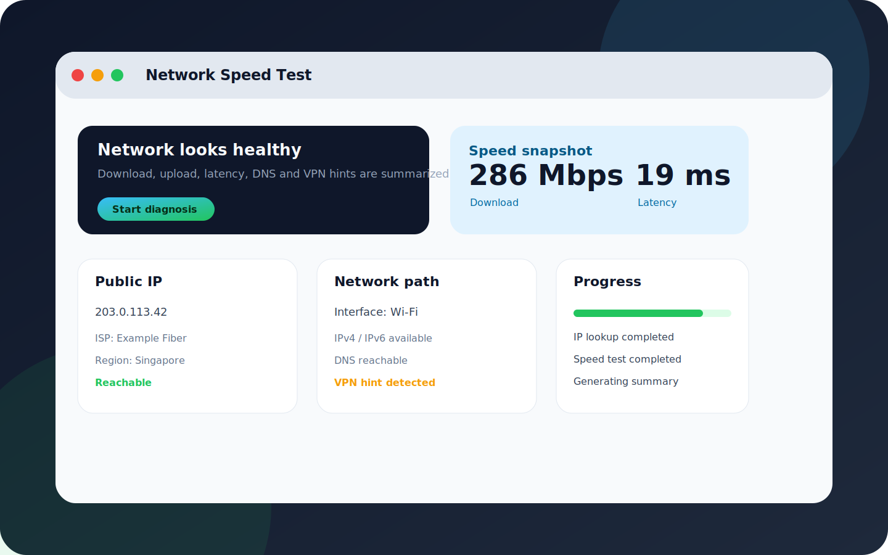
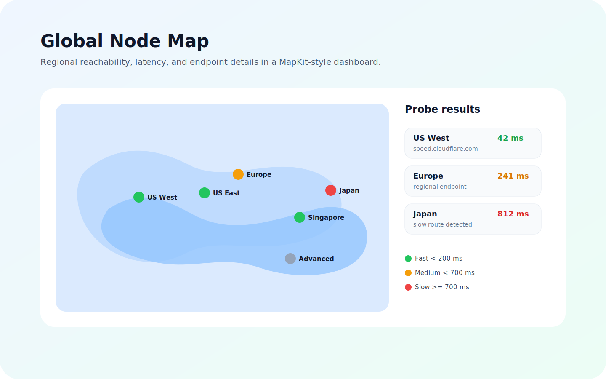

# Network Speed Test

A SwiftUI network speed test and diagnostics app for macOS, with shared source that can be adapted for iOS.

Network Speed Test combines public IP lookup, local network path inspection, HTTPS download/upload sampling, latency and jitter checks, VPN hints, and a MapKit-based global node view. It is designed as an open-source starting point for learning, local troubleshooting, and building your own network diagnostics tool.



## Features

- Public IP lookup with fallback providers.
- Local network path snapshot using `Network.framework`.
- VPN interface hints from `utun`, `tun`, `tap`, and `ppp` interfaces.
- Download, upload, latency, and jitter sampling over HTTPS.
- Regional probe list for approximate global reachability and latency checks.
- Diagnosis summary that helps compare local network issues, VPN behavior, DNS issues, and routing problems.
- Structured findings with user-facing repair recommendations.
- Step-by-step diagnosis progress so users can see which checks are running, completed, or failed.
- MapKit global node map with latency-based colors and hover details.
- Local quota/cost-guardrail demo for high-traffic speed test scenarios.

## Screenshots




## Requirements

- macOS 14 or later
- Swift 6.2 or later
- Xcode with SwiftUI and MapKit support

## Run

On macOS, prefer the launch script. It builds a lightweight `.app` bundle with the app icon, packages SwiftPM resources, and brings the GUI window to the front:

```sh
chmod +x scripts/run-mac.sh
./scripts/run-mac.sh
```

You can also run the raw Swift Package executable:

```sh
swift run NetworkTestApp
```

The raw executable is useful for quick iteration, but it is not a full `.app` bundle and may not show the Finder/Dock icon. Use `scripts/run-mac.sh` for local app-style testing.

## Project Structure

```text
Sources/NetworkTestApp/
  Models/        Shared data models
  Services/      IP lookup, speed test, regional probes, path snapshots
  ViewModels/    Diagnosis orchestration
  Views/         SwiftUI dashboard and result cards
Tests/           Diagnosis engine tests
scripts/         macOS launch helper
```

## Notes

This project uses public HTTPS endpoints, so regional throughput is an approximation. For production-grade global speed results, replace `EndpointCatalog` with self-owned regional nodes, such as LibreSpeed servers, VPS nodes, or CDN object storage endpoints.

The quota and cost-guardrail screens are local demos only. If you connect real accounts, payments, or self-hosted bandwidth, enforce quotas and signed test URLs on your server.

## License

MIT
